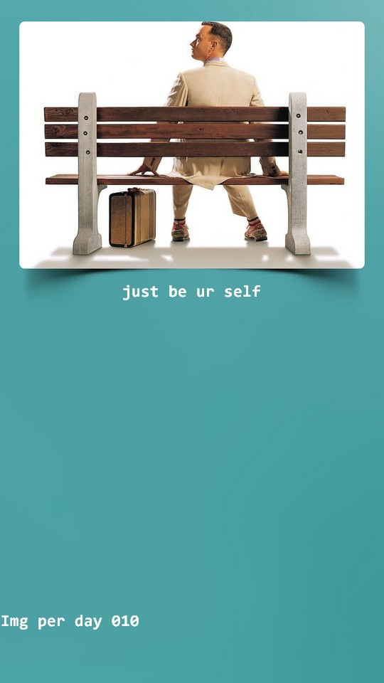

datetime:2019/11/14 21:30 utc+8  
datetime:2019/11/14 08:30 utc -5  
  
>not good.  
>this time ,i'm not angry,i'm worried now.  
>bad day,not good mood,stange,have no ider what to do,loney...  
>good day only keep a day ,even less than 24 hours.  
>other people or things will influence her.  
>why u just can't be youself. don't let others bother u.  
>again and again ,u will be tired at a time.  
>u will not continue be this until u push ur self,change from inner,heart,mind,dream.  

just be ur self.  
and keep remmenber your original aspiration.  
